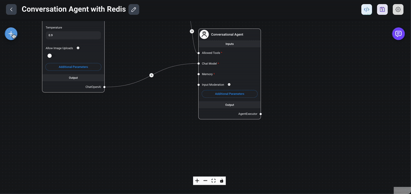

import Authors from '@theme/Authors';

<Authors frontMatter={frontMatter} />

In this tutorial, we will explore how to build a conversational agent with Redis using [Flowise](https://flowiseai.com/). Flowise is a powerful, open-source, and user-friendly AI platform that allows you to build and deploy conversational agents (and many other LLM flows) quickly using a simple and intuitive interface.

## What is a Conversational Agent?

Normal LLMs (Large Language Models) like GPT-4 are general-purpose models trained on diverse datasets to perform a wide range of language-related tasks, such as text generation, translation, summarization, and more.

Conversational agents, however, are more sophisticated and designed specifically for managing conversations effectively. They often integrate multiple specialized agents or modules to handle specific tasks, providing a comprehensive and interactive experience.

### Example

Question:
`Who won the latest 2024 elections in India?`

Normal LLM (GPT-4) Response:
`Sorry, I don't have information about the results of that election.`

Conversational Agent Response:
`Prime Minister Narendra Modi's Bharatiya Janata Party (BJP) and its National Democratic Alliance (NDA) won the most seats in the latest 2024 elections in India.`

- A normal LLM cannot answer questions about the latest news, projects, etc., as it is not trained on real-time data.
- In contrast, a conversational agent can handle such queries because it integrates an LLM at its core along with other specialized agents to manage specific tasks. In our conversational agent example, we will use ChatOpenAI combined with a SearchAPI agent to answer questions about the latest news, weather, and other real-time information.
- The [SearchAPI](https://www.searchapi.io/) agent is a specialized module capable of fetching data from Google search results, enabling our conversational agent to provide up-to-date and relevant answers.

In the following sections, we will guide you through the process of setting up Redis with Flowise, configuring the necessary agents, and testing your conversational agent.

## Setup Flowise

There are [different ways](https://docs.flowiseai.com/getting-started) to install Flowise. For this tutorial, we’ll use the Docker Compose method to install Flowise.

**Step-by-Step Instructions**

1. Clone the Flowise Repository from GitHub:

Start by cloning the Flowise repository to your local machine.

```sh
git clone https://github.com/FlowiseAI/Flowise.git
```

2. Navigate to the Docker Folder:

Change your directory to the docker folder located at the root of the Flowise project.

```sh
cd Flowise/docker
```

3. Copy the .env File:

Copy the example environment file and rename it to .env. This file contains configuration settings for your Docker containers.

```sh
cp .env.example .env
```

4. Start the Docker Application:

Use the following command to start the Docker application in detached mode.

```sh
docker-compose up -d
```

This command will download the necessary Docker images and start the Flowise application.

5. Access Flowise in Your Browser:

Open your browser and navigate to [http://localhost:3000](http://localhost:3000) to access the Flowise application.

6. Stop the Docker Containers:

If you need to stop the Docker containers, you can do so with the following command:

```sh
docker-compose stop
```

By following these steps, you will have Flowise up and running on your local machine, ready for you to start building and testing your conversational agents.

## Creating a Chatflow

**Step-by-Step Instructions**

1. Navigate to the Chatflows Menu:

Open your browser and go to http://localhost:3000. In the Flowise application, navigate to the Chatflows menu.

2. Create a New Chatflow:

Click on the `+ Add new` button to create a new chatflow.


3. Save and Name Your Chatflow:

Click on the save icon. A prompt will appear asking you to name your chatflow. Enter a meaningful name that describes the purpose of your chatflow.


By following these steps, you will create and name a new chatflow in Flowise, setting the foundation for building your conversational agent

## Adding a Conversational Agent Node

1. Drag the Conversational Agent Node:

From the Agents section in the Flowise interface, drag the Conversational Agent node into your chatflow workspace.


2. Modify Additional Parameters:

In the node’s settings, you have the option to modify the system message prompt. This prompt is used to set the context for the chatbot, ensuring it understands the specific domain or behavior you want it to exhibit.

3. Save the Chatflow:

Make sure to save your chatflow regularly to persist any intermediate changes. Click on the save icon to ensure your modifications are not lost.

By following these steps, you will have successfully added a conversational agent node to your chatflow and set the initial context for your chatbot. In subsequent sections, we will integrate additional nodes and configure the chatbot to interact with Redis and other specialized agents.

## Adding a SearchAPI Node

1. Drag the SearchAPI Node:

From the Tools section in the Flowise interface, drag the SearchAPI node into your chatflow workspace. The SearchAPI node acts as an agent capable of fetching data from Google search results.


2. Connect to Conversational Agent Node:
   Connect the SearchAPI node to the Conversational Agent node by drawing a line from the output of the Conversational Agent node to the input of the SearchAPI node. This connection allows the conversational agent to utilize the search capabilities provided by the SearchAPI.
3. Set the SearchAPI Key:
   In the settings of the SearchAPI node, enter your SearchAPI key. This key is necessary for the node to authenticate and perform search queries.
4. Combine Multiple Tools:
   You can enhance the capabilities of your Conversational Agent by adding multiple tools. For example, you can integrate SearchAPI, Calculator, and Python Interpreter nodes. The Conversational Agent will automatically select the appropriate tool to handle specific types of queries.
5. Save the Flow:
   Regularly save your chatflow to persist any changes. Click on the save icon to ensure all configurations and connections are stored.

By following these steps, you will have successfully integrated a SearchAPI node into your chatflow, allowing your conversational agent to fetch real-time data from Google search results.

## Adding a ChatOpenAI Node

1. Drag the ChatOpenAI Node:
   From the Chat Models section in the Flowise interface, drag the ChatOpenAI node into your chatflow workspace.


2. Create an OpenAI Key:
   If you haven’t already created an OpenAI key, do so by clicking on the Create new button within the node’s settings. This key is essential for authenticating requests to the OpenAI API.
3. Choose a Model:
   Select a model from the available options. The model determines the behavior and capabilities of your conversational agent. For example:
   • GPT-3: Known for its large capacity and diverse language generation abilities.
   • GPT-4: An enhanced version with improved understanding and generation capabilities.
   Model Explanation:
   A model in the context of OpenAI refers to a specific version of the language model that has been trained on various datasets to perform specific tasks. Each model version (like GPT-3 or GPT-4) has its unique characteristics and strengths.
4. Set the Temperature:
   The temperature parameter controls the randomness of the model’s responses. It ranges from 0 to 1:
   • Low Temperature (e.g., 0.2): Produces more deterministic and focused responses.
   • High Temperature (e.g., 0.8): Produces more creative and varied responses.
   Temperature Explanation:
   Temperature is a parameter that influences the creativity and variability of the model’s output. Lower values result in more predictable responses, while higher values introduce more randomness.
5. Set Additional Parameters:
   Configure other parameters such as max_tokens, which defines the maximum number of tokens (words or parts of words) the model can generate in a single response.
   Max Tokens Explanation:
   The max_tokens parameter sets a limit on the length of the generated response. A higher value allows for longer responses, while a lower value restricts the length.
6. Save the Flow:
   Ensure you save your chatflow regularly to preserve all changes. Click on the save icon to store your configurations and connections.

By following these steps, you will have successfully added and configured a ChatOpenAI node in your chatflow. This node will serve as the core conversational engine, leveraging OpenAI’s powerful language models to generate responses. In subsequent sections, we will further enhance your chatflow with additional nodes and fine-tune the overall behavior of your conversational agent.

## Adding a Redis Chat Memory Node

1. Drag the Redis Chat Memory Node:
   From the Memory section in the Flowise interface, drag the Redis backed chat memory node into your chatflow workspace.



2. Choose its Key:
   In the node’s settings, choose or create a key for the Redis instance. This key will be used to store and retrieve chat memory data.
3. Set Key Prefix:
   In the additional parameters section, you can set a key prefix. This prefix helps in organizing and identifying the chat memory records stored in Redis.
4. Save the Flow:
   Regularly save your chatflow to ensure all configurations and connections are persisted. Click on the save icon to store your changes.

:::info
Why Use Redis for Chat Memory?

Speed:
Redis is an in-memory data store, which means it can quickly read and write data, providing low-latency access to chat history. This speed is crucial for maintaining a seamless and responsive conversational experience.

Persistence:
Redis also supports persistence, allowing chat data to be stored permanently. This means even if the application restarts or crashes, the chat history can be recovered, ensuring continuity in conversations.
:::

By following these steps, you will have successfully added a Redis chat memory node to your chatflow. This integration ensures that your conversational agent can remember and utilize past interactions, enhancing the overall user experience. In the next sections, we will finalize the chatflow setup and test the complete system.

## Testing the Chatflow

1. Initiate the Test:
   Click on the chat icon to start testing your chatflow.


2. Start the Chat:
   Begin the chat session to interact with your newly created conversational agent.
3. Ask Questions:
   Test the functionality by asking questions such as, `Who won the latest 2024 elections in India?`
4. Check the Response:
   Evaluate the response provided by the chatflow. Ensure that it correctly fetches and presents information based on the integrated nodes (e.g., SearchAPI, ChatOpenAI, Redis chat memory).

By following these steps, you will be able to test and validate the functionality of your chatflow, ensuring that your conversational agent is working as expected and providing accurate and relevant responses.

## RedisInsight output

## Export / import the chatflow

## Conclusion
