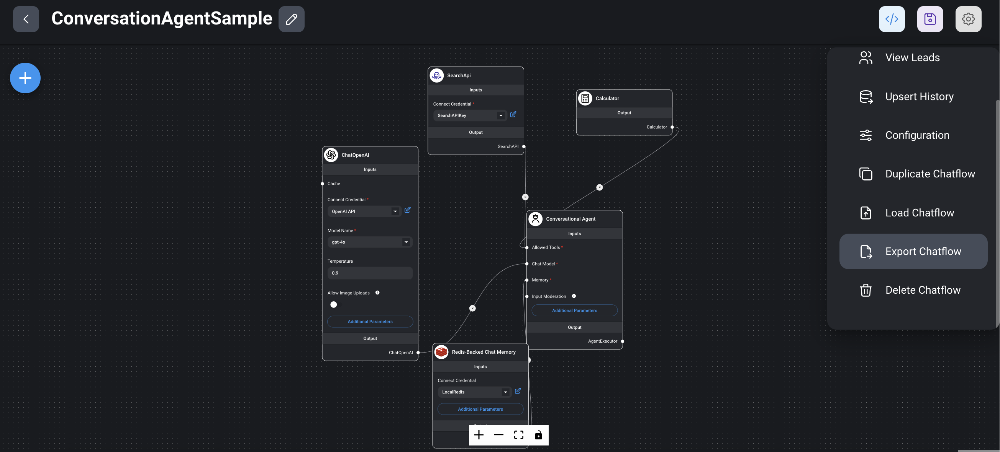

import Authors from '@theme/Authors';

<Authors frontMatter={frontMatter} />

In this tutorial, we will explore how to build a conversational agent with Redis using [Flowise](https://flowiseai.com/). Flowise is a powerful, open-source, and user-friendly AI platform that allows you to build and deploy conversational agents (and many other LLM flows) quickly using a simple and intuitive interface.

## What is a conversational agent?

Normal LLMs (Large Language Models) like GPT-4 are general-purpose models trained on diverse datasets to perform a wide range of language-related tasks, such as text generation, translation, summarization, and more.

Conversational agents, however, are more sophisticated and designed specifically for managing conversations effectively. They often integrate multiple specialized agents or modules to handle specific tasks, providing a comprehensive and interactive experience.

### Example

Question:

`Who won the latest 2024 elections in India?`

Normal LLM (GPT-4) response:

`Sorry, I don't have real-time access to current events or updates, including recent election outcomes. To find out who won the latest 2024 elections in India, I recommend checking the most recent news on a reliable news website or a trusted media outlet.`

Conversational agent response:

`Prime Minister Narendra Modi's Bharatiya Janata Party (BJP) and its National Democratic Alliance (NDA) won the most seats in the latest 2024 elections in India.`

- A normal LLM cannot answer questions about the latest news, projects, etc., as it is not trained on real-time data.
- In contrast, a conversational agent can handle such queries because it integrates an LLM at its core along with other specialized agents to manage specific tasks. In our conversational agent example, we will use `ChatOpenAI` combined with a `SearchAPI` agent to answer questions about the latest news, weather, and other real-time information.
- The [SearchAPI](https://www.searchapi.io/) agent is a specialized module capable of fetching data from Google search results, enabling our conversational agent to provide up-to-date and relevant answers.

In the following sections, we will guide you through the process of setting up Redis with Flowise, configuring the necessary agents, and testing your conversational agent.

## Setup Flowise

There are [different ways](https://docs.flowiseai.com/getting-started) to install Flowise. For this tutorial, we’ll use the Docker Compose method to install Flowise.

**Step-by-step instructions**

1. **Clone the Flowise repository from GitHub:**

```sh
git clone https://github.com/FlowiseAI/Flowise.git
```

2. **Navigate to the docker folder:**

```sh
cd Flowise/docker
```

3. **Copy the .env file:** Copy the example environment file and rename it to .env. This file contains configuration settings for your Docker containers.

```sh
cp .env.example .env
```

4. **Start the docker application:** Use the following command to start the Docker application in detached mode. This command will download the necessary Docker images and start the Flowise application.

```sh
docker-compose up -d
```

5. **Access Flowise in your browser:** Open your browser and navigate to [http://localhost:3000](http://localhost:3000) to access the Flowise application.

6. **Stop the Docker containers:** If you need to stop the Docker containers, you can do so with the following command:

```sh
docker-compose stop
```

By following these steps, you will have Flowise up and running on your local machine, ready for you to start building and testing your conversational agents.

## Creating a new chatflow

**Step-by-step instructions**

1. **Navigate to the Chatflows menu:** Open your browser and go to http://localhost:3000. In the Flowise application, navigate to the Chatflows menu.

2. **Create a new chatflow:** Click on the `+ Add new` button to create a new chatflow.


3. **Save and name your chatflow:** Click on the save icon. A prompt will appear asking you to name your chatflow. Enter a meaningful name that describes the purpose of your chatflow.


By following these steps, you will create a empty chatflow in Flowise, setting the foundation for building your conversational agent

## Adding a conversational agent node


1. **Drag the conversational agent node:** From the `Agents` section in the Flowise interface, drag the `Conversational Agent` node into your chatflow workspace.

2. **Modify additional parameters:** In the node's settings, you have the option to modify the system message prompt. This prompt is used to set the context for the chatbot, ensuring it understands the specific domain or behavior you want it to exhibit.

3. **Save the chatflow:** Make sure to save your chatflow regularly to persist any intermediate changes. Click on the save icon to ensure your modifications are not lost.

By following these steps, you will have successfully added a conversational agent node to your chatflow and set the initial context for your chatbot. In subsequent sections, we will integrate additional nodes and configure the chatbot to interact with Redis and other specialized agents.

## Adding a SearchAPI node


1. **Drag the SearchAPI node:** From the `Tools` section in the Flowise interface, drag the `SearchAPI` node into your chatflow workspace. The SearchAPI node acts as an agent capable of fetching data from Google search results.

2. **Connect to conversational agent node:** Connect the SearchAPI node to the Conversational Agent node by drawing a line from the output of the Conversational Agent node to the input of the SearchAPI node. This connection allows the conversational agent to utilize the search capabilities provided by the SearchAPI.

3. **Set the SearchAPI key:** In the interface of the SearchAPI node, enter your SearchAPI key. This key is necessary for the node to authenticate and perform search queries.

4. **Combine multiple tools:** You can enhance the capabilities of your Conversational Agent by adding multiple tools. For example, you can integrate `SearchAPI`, `Calculator`, and `Python Interpreter` nodes. The Conversational Agent will automatically select the appropriate tool to handle specific types of queries.

5. **Save the flow:** Regularly save your chatflow to persist any changes. Click on the save icon to ensure all configurations and connections are stored.

By following these steps, you will have successfully integrated a SearchAPI node into your chatflow, allowing your conversational agent to fetch real-time data from Google search results.

## Adding a ChatOpenAI node


1. **Drag the ChatOpenAI node:** From the Chat Models section in the Flowise interface, drag the `ChatOpenAI` node into your chatflow workspace.

2. **Create an OpenAI key:** If you haven't already created an OpenAI key, do so by clicking on the Create new button within the node's interface. This key is essential for authenticating requests to the OpenAI API.

3. **Choose a model:** Select a model like GPT-3, GPT-4 ..etc from the available options. The model determines the behavior and capabilities of your conversational agent.

4. **Set the temperature:** The temperature parameter controls the randomness of the model's responses. It ranges from 0 to 1:

   - Low temperature (e.g., 0.2): Produces more deterministic and focused responses.
   - High temperature (e.g., 0.8): Produces more creative and varied responses.

5. **Set additional parameters:** Configure other parameters such as max_tokens, which defines the maximum number of tokens (words or parts of words) the model can generate in a single response.

6. **Save the flow:** Ensure you save your chatflow regularly to preserve all changes. Click on the save icon to store your configurations and connections.

By following these steps, you will have successfully added and configured a ChatOpenAI node in your chatflow. This node will serve as the core conversational engine, leveraging OpenAI's powerful language models to generate responses. In subsequent sections, we will further enhance your chatflow with additional nodes to build a conversational agent.

## Adding a Redis chat memory node


1. **Drag the Redis chat memory node:** From the `Memory` section in the Flowise interface, drag the Redis backed chat memory node into your chatflow workspace.

2. **Choose its key:** In the node's interface, choose or create a key for the Redis instance. This key will be used to store and retrieve chat memory data.

3. **Set key prefix:** In the additional parameters section, you can set a key prefix. This prefix helps in organizing and identifying the chat memory records stored in Redis.
4. **Save the flow:** Regularly save your chatflow to ensure all configurations and connections are persisted. Click on the save icon to store your changes.

:::info
Why Use Redis for chat memory?

**Speed:**
Redis is an in-memory data store, which means it can quickly read and write data, providing low-latency access to chat history. This speed is crucial for maintaining a seamless and responsive conversational experience.

**Persistence:**
Redis also supports persistence, allowing chat data to be stored permanently. This means even if the application restarts or crashes, the chat history can be recovered, ensuring continuity in conversations.
:::

By following these steps, you will have successfully added a Redis chat memory node to your chatflow. This integration ensures that your conversational agent can remember and utilize past interactions, enhancing the overall user experience. In the next sections, we will finalize the chatflow setup and test the complete system.

## Testing the chatflow


1. **Initiate the test:** Click on the chat icon to start testing your chatflow.

2. **Start the chat:** Begin the chat session to interact with your newly created conversational agent.
3. **Ask questions:** Test the functionality by asking latest questions such as, `What is Redis Data Integration (RDI)?`
4. **Check the response:** Evaluate the response provided by the chatflow. Ensure that it correctly fetches and presents information based on the connected tools (e.g., SearchAPI).
   Click on the tool button above the chatflow response message to view details of the tools used.
   

By following these steps, you will be able to test and validate the functionality of your chatflow, ensuring that your conversational agent is working as expected and providing accurate and relevant responses.

## Verifying chatflow data with RedisInsight

[RedisInsight](https://redis.com/redis-enterprise/redis-insight/) is a powerful GUI tool that allows you to interact with Redis data visually. It provides an easy way to verify and manage the persisted data in your Redis instance.


**Example of stored chat data**

In our example, Redis stores the chat data in a list with each entry representing a message in the conversation. Here are examples of how these entries might look:

```json
{
  "type": "ai",
  "data": {
    "content": "Prime Minister Narendra Modi's Bharatiya Janata Party (BJP) and its National Democratic Alliance (NDA) won the most seats in the latest 2024 elections in India. However, they fell short of securing an outright majority in parliament.",
    "tool_calls": [],
    "invalid_tool_calls": [],
    "additional_kwargs": {},
    "response_metadata": {}
  }
}
{
  "type": "human",
  "data": {
    "content": "Who won the latest 2024 elections in India?",
    "additional_kwargs": {},
    "response_metadata": {}
  }
}
```

- Type: Indicates the origin of the message. It can be either ai (response generated by the AI) or human (message input by the user).

- Data:
  - Content: The main text of the message. For AI responses, this is the generated answer. For human messages, this is the user's input.
  - Tool calls: A list of calls made to external tools or APIs during the generation of the response.
  - Invalid tool calls: A list of tool calls that failed or were invalid.
  - Additional kwargs: Additional keyword arguments that might have been used during the message processing.
  - Response metadata: Metadata associated with the response, such as timestamps or processing details.

By using RedisInsight, you can easily monitor and manage the data generated by your conversational agent, ensuring that all interactions are correctly logged and stored in Redis. This can be invaluable for debugging, improving the agent's performance, and maintaining a high-quality user experience.

## Exporting and importing chatflows

Flowise allows you to easily export and import chatflows, enabling you to save your work for future use or share it with others. Below are the steps to export and import chatflows.

**Exporting a chatflow**



1. **Navigate to the chatflows menu:** Go to the Chatflows menu in the Flowise interface.
2. **Select an existing chatflow:** Choose the chatflow you want to export from the list of existing chatflows.
3. **Export the chatflow:** Click on the settings icon and select the Export chatflow menu item.
4. **Download the JSON file:** The chatflow will be exported as a JSON file, which you can [download](./ConversationAgentSampleChatflow.json) and save for future use.

**Importing a chatflow**


1. **Navigate to the chatflows menu:** Go to the Chatflows menu in the Flowise interface.
2. **Create a new chatflow:** Click on the + Add new button to create a new chatflow.
3. **Import the chatflow:** Click on the settings icon and select the Load chatflow menu item.
4. **Add the exported JSON file:** Upload the previously exported JSON file.
5. **Configure the imported chatflow:** The imported chatflow will appear without credentials. Ensure you provide the necessary credentials for any nodes requiring authentication (e.g., OpenAI key, SearchAPI key) and save the chatflow to persist the changes.
6. **Test the chatflow**: Once the chatflow is imported and configured, initiate a chat session to ensure it works as expected. Ask questions or perform actions to validate the chatflow's functionality.

By following these steps, you can efficiently export and import chatflows in Flowise, facilitating easy backup, sharing, and reuse of your conversational agent configurations.

## Conclusion

By following this tutorial, you have successfully built a sophisticated conversational agent using Flowise and Redis. Flowise's intuitive interface and powerful integration capabilities, combined with Redis's speed and persistence, provide a robust platform for creating and deploying highly interactive and responsive AI chatbots. With these tools, you can handle complex queries, fetch real-time data, and maintain seamless user interactions.

## Try complex example?

- Add RAG example (gif, chatflow JSON, sample text files)
