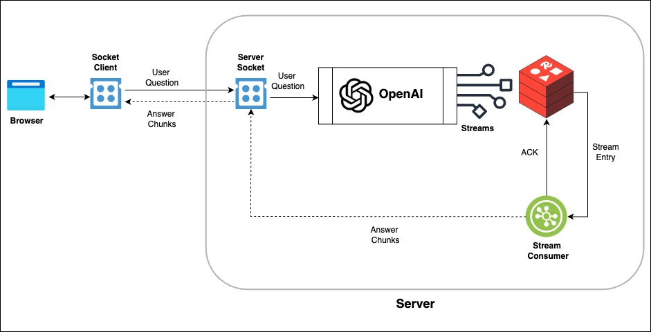
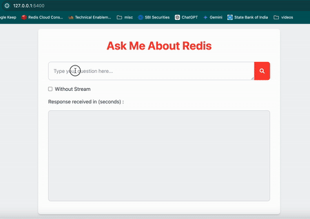
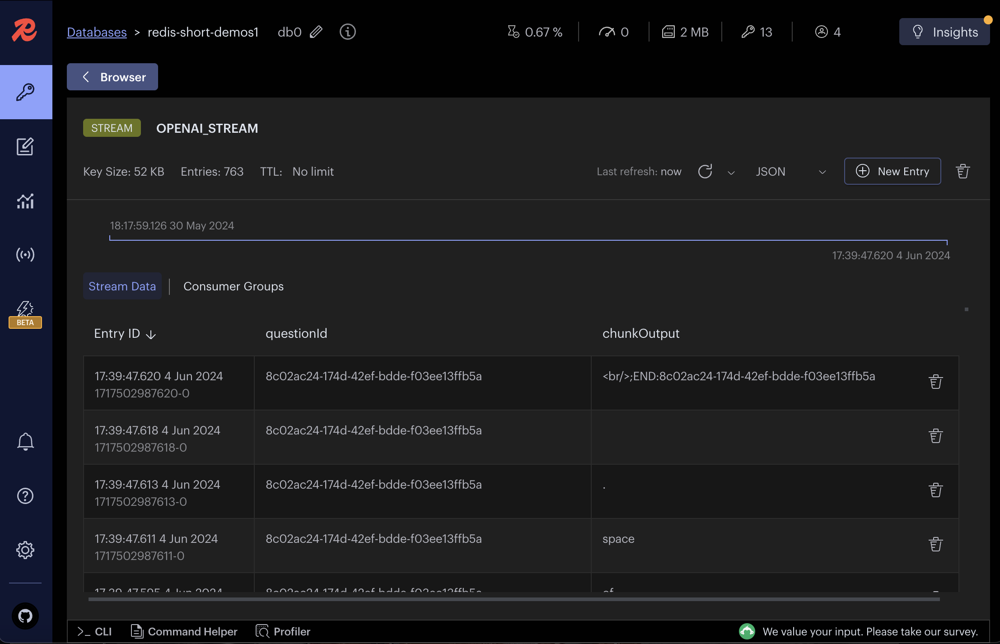
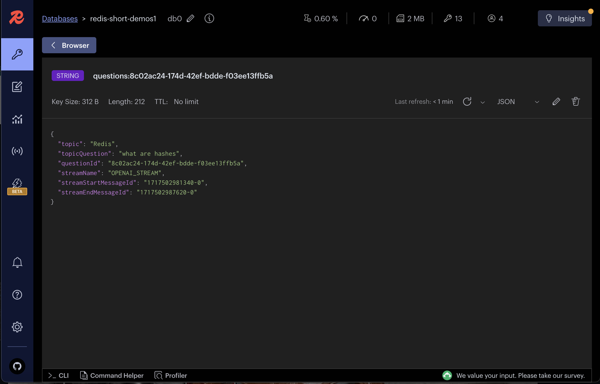

import Authors from '@theme/Authors';

<Authors frontMatter={frontMatter} />

In this tutorial, we will explore how to stream output (in chunks) from a Large Language Model (LLM) to a browser using Redis Streams.

## What are Redis streams?

[Redis Streams](https://redis.io/docs/latest/develop/data-types/streams/) are powerful data structure that allows you to efficiently handle streams of data, similar to message queues or append-only logs.

You can store multiple fields and string values with an automatic ID generated for each stream entry.

## Advantages of using Redis streams

- **Real-time streaming**: Redis Streams allow you to stream data in real-time to multiple consumers. In our demo case, user can see the output in real-time as it is generated instead of waiting for the entire LLM output to be generated.
- **Scalability**: Redis Streams are highly scalable and can handle a **large volumes** of messages.
- **Persistence**: Redis Streams provide persistence, allowing for reliable message delivery and replay capabilities in case of failures.
- **Consumer groups**: Redis Streams support consumer groups, which allow multiple consumers to read from the same stream. Each consumer can read and acknowledge messages independently, ensuring that message is processed only once.
- **Easy Integration**: Redis Streams can be easily integrated with various clients and servers, making it a versatile choice for streaming data.
- **Producer/ Consumer problems** : Fast Producer and slow consumer problem can be solved using Redis streams where consumers can read at their own pace but producer can keep producing messages at higher rate without losing any data.

## Architecture Flow

The architecture flow of the application is as follows:



1. The browser sends a user question to the server using sockets.
2. The server receives the user question via sockets and forwards it to OpenAI (LLM) for processing.
3. OpenAI processes the user question and returns a response in chunks, which are then added to a Redis stream.
4. A stream consumer listens to the Redis stream and broadcasts the chunks to connected clients through sockets.

## Demo Setup

- Download the source code of demo from the GitHub repository and navigate to the `streaming-llm-output` directory.

:::tip GITHUB CODE

git clone https://github.com/redis-developer/redis-short-demos.git
cd redis-short-demos/streaming-llm-output
:::

- Install the dependencies

```sh
npm install
```

- Create a `.env` file in the root of the project and add the following environment variables.

```sh
OPENAI_API_KEY=
OPENAI_ORGANIZATION=
REDIS_URL="redis://localhost:6379/"
```

- Start the application

```sh
# Start the backend node server
npm run backend

# Start the frontend app
npm run frontend
```

- Open `http://127.0.0.1:5400/` in your browser to play with demo



Once you have the application running, you can ask a question in the input box and click on the search button. The application will stream the output from the LLM in real-time instead of waiting for the entire output to be generated.

Now, Select `Without Stream` checkbox and click on search button to see the output without streaming. In this case, you will notice a delay in displaying the output as it waits for the entire output to be generated.

## How it works ?

Let's dive into the code snippets to understand how we can stream LLM output to the browser using Redis Streams.

### Redis Utilities

This module provides utility functions to interact with Redis Streams.

```ts title="streaming-llm-output/src/utils/redis-wrapper.ts"
import { commandOptions, createClient } from 'redis';
import { LoggerCls } from './logger.js';

// Function to add an item to a Redis Stream
async function addItemToStream(streamKey: string, item: any) {
  let insertedId = '';
  try {
    const client = getConnection();
    if (streamKey && item && client) {
      const id = '*'; // Auto-generate ID
      insertedId = await client.xAdd(streamKey, id, item);
    }
  } catch (err) {
    LoggerCls.error('addItemToStream', err);
  }

  return insertedId;
}

// Function to get the last ID of a Redis Stream
async function getLastIdOfStream(streamKey: string) {
  let lastId = '0-0';
  try {
    if (streamKey) {
      /*
        xRevRange(): Read stream in reverse order 
        startId: + represents latest item
        endId: - represents oldest item
        COUNT: 1 to get only 1 item
        */
      const result = await nodeRedisClient?.xRevRange(streamKey, '+', '-', {
        COUNT: 1,
      });
      if (result && result.length > 0) {
        lastId = result[0].id;
      }
    }
  } catch (err) {
    console.log(err);
  }

  return lastId;
}

// Function to read from a Redis Stream
async function readStream(
  stream: string, // stream key
  lastId: string, // id to start reading from
  startChunk: string, // listen message to start sending data to callback
  endChunk: string, // listen message to stop reading
  clientId: string, // socket id
  activeListeners: Map<string, boolean>, // to keep track of active socket listeners
  callback: (data: any, id?: string) => void,
) {
  let reading = false;

  const isActiveClient = activeListeners.get(clientId);
  // loop for active clients only
  while (isActiveClient) {
    try {
      const results = await nodeRedisClient?.xRead(
        commandOptions({
          isolated: true,
        }),
        { key: stream, id: lastId },
        { BLOCK: 0, COUNT: 1 }, // BLOCK 0 (ms) means don't timeout till new data is available
      );

      if (results) {
        for (const result of results) {
          for (const item of result.messages) {
            if (item?.message?.chunkOutput.startsWith(startChunk)) {
              // start reading only if startChunk is found
              reading = true;
            }

            if (reading) {
              lastId = item.id;
              //send stream data to callback
              callback(item.message, lastId);

              if (item?.message?.chunkOutput.endsWith(endChunk)) {
                console.log('End of chunk found');
                return; // exit loop if endChunk is found
              }
            }
          }
        }
      }
    } catch (err) {
      LoggerCls.error('readStream', err);
    }
  }
}

// Function to set a JSON item in Redis
async function setJsonItem(_key: string, _value: any) {
  const result = await nodeRedisClient?.set(_key, JSON.stringify(_value));
  return result;
}
```

### LLM Prompting

This module handles creating prompts and streaming responses from the LLM.

```ts title="streaming-llm-output/src/question.ts"
import { ChatOpenAI } from '@langchain/openai';
import {
  ChatPromptTemplate,
  SystemMessagePromptTemplate,
} from '@langchain/core/prompts';
import { HumanMessage, SystemMessage } from '@langchain/core/messages';
import { StringOutputParser } from '@langchain/core/output_parsers';

import * as redisUtils from './utils/redis-wrapper.js';
import { LoggerCls } from './utils/logger.js';

// Function to get LLM chain for a user question
const getQuestionChain = async function (
  _model: ChatOpenAI,
  _questionId: string,
  _topic: string,
  _topicQuestion: string,
) {
  const outputParser = new StringOutputParser();

  // Create a prompt
  let systemMsg = SystemMessagePromptTemplate.fromTemplate(
    `You are an expert in answering questions about {topic}.
       All questions are about particular topic "{topic}". 
       Make sure your answer is related to {topic}. `,
  );
  let humanMsg = new HumanMessage(_topicQuestion);
  const prompt = ChatPromptTemplate.fromMessages([systemMsg, humanMsg]);

  LoggerCls.info('Prompt: \n', await prompt.format({ topic: _topic }));

  // Create a pipeline chain
  const chain = prompt.pipe(_model).pipe(outputParser);

  return chain;
};

// Function to ask a question to LLM and stream the output
const askQuestion = async function (
  _model: ChatOpenAI,
  _questionId: string,
  _topic: string,
  _topicQuestion: string,
  _streamName: string,
) {
  if (_model && _topic && _topicQuestion) {
    const startChunkLbl = `START:${_questionId};<br/>`;
    const endChunkLbl = `<br/>;END:${_questionId}`;

    const chain = await getQuestionChain(
      _model,
      _questionId,
      _topic,
      _topicQuestion,
    );

    // Stream the output
    let streamHandle = await chain.stream({
      topic: _topic,
    });

    // add start chunk to stream
    const questionStartMessageId = await redisUtils.addItemToStream(
      _streamName,
      {
        questionId: _questionId,
        chunkOutput: startChunkLbl,
      },
    );

    // add LLM output chunks to stream
    for await (const chunk of streamHandle) {
      //LoggerCls.debug(chunk);

      await redisUtils.addItemToStream(_streamName, {
        questionId: _questionId,
        chunkOutput: chunk.toString(),
      });
    }

    // add end chunk to stream
    const questionEndMessageId = await redisUtils.addItemToStream(_streamName, {
      questionId: _questionId,
      chunkOutput: endChunkLbl,
    });

    // add question details/ meta data to redis (for future re-read of stream)
    const questionDetails = {
      topic: _topic,
      topicQuestion: _topicQuestion,
      questionId: _questionId,
      streamName: _streamName,
      streamStartMessageId: questionStartMessageId,
      streamEndMessageId: questionEndMessageId,
    };
    await redisUtils.setJsonItem(`questions:${_questionId}`, questionDetails);
  }
};
```

### Socket Server

This module sets up a Socket.IO server events to handle real-time communication between the client and server.

```ts title="streaming-llm-output/src/socket-x-read.ts"
import { v4 as uuidv4 } from 'uuid';
import { Server } from 'socket.io';
import { ChatOpenAI } from '@langchain/openai';

import * as redisUtils from './utils/redis-wrapper.js';
import { LoggerCls } from './utils/logger.js';
import { askQuestion } from './question.js';
import { CONFIG } from './config.js';

// setup socket to read stream
const initSocketXRead = async (socketServer: Server, model: ChatOpenAI) => {
  const activeListeners = new Map<string, boolean>();

  // listen for new socket connections
  socketServer.on('connection', (socket) => {
    LoggerCls.info('a user connected');
    activeListeners.set(socket.id, true);

    // listen for askQuestion event
    socket.on('askQuestion', async ({ topic, topicQuestion }) => {
      const questionId = uuidv4();

      //lastId to prevent re scan of older data
      const lastId = await redisUtils.getLastIdOfStream(CONFIG.OPENAI_STREAM);

      // trigger `askQuestion` asynchronously, It sends  question to OpenAI API and stores the response in the Redis stream as chunks
      askQuestion(
        model,
        questionId,
        topic,
        topicQuestion,
        CONFIG.OPENAI_STREAM,
      );

      // Read messages from Redis stream between startChunk and endChunk
      const startChunk = `START:${questionId};`;
      const endChunk = `;END:${questionId}`;
      redisUtils.readStream(
        CONFIG.OPENAI_STREAM,
        lastId,
        startChunk,
        endChunk,
        socket.id,
        activeListeners,
        (data) => {
          LoggerCls.info(data.chunkOutput);
          // Emit the chunk to the client (browser)
          socket.emit('chunk', data.chunkOutput);
        },
      );
    });

    socket.on('disconnect', () => {
      LoggerCls.info('user disconnected');
      activeListeners.set(socket.id, false);
    });
  });
};
```

### Express Server

This module sets up an Express server and integrates the Socket.IO server.

```ts title="streaming-llm-output/src/index.ts"
import express from 'express';
import cors from 'cors';
import { createServer } from 'http';
import { Server } from 'socket.io';

import { ChatOpenAI } from '@langchain/openai';

import { v4 as uuidv4 } from 'uuid';

import { config } from 'dotenv';
import * as redisUtils from './utils/redis-wrapper.js';
import { LoggerCls } from './utils/logger.js';
import { initSocket } from './socket.js';

config();

const model = new ChatOpenAI({
  modelName: 'gpt-4',
  apiKey: process.env.OPENAI_API_KEY,
});

//---- express server
const app = express();
const httpServer = createServer(app);
const socketServer = new Server(httpServer, {
  cors: {
    origin: '*',
    methods: ['GET', 'POST'],
  },
});

app.use(cors());
app.use(express.json());

httpServer.listen(3000, async () => {
  const REDIS_URL = process.env.REDIS_URL || '';
  await redisUtils.setConnection(REDIS_URL);

  // set up socket server events
  initSocketXRead(socketServer, model);

  LoggerCls.info('Backend listening on *:3000');
});
//---- express server
```

Now, back end server listens for the `askQuestion` socket event from the client (browser) and triggers the `askQuestion` function to send the question to the LLM and stream the output to the Redis stream.
The `readStream` function reads the stream data and emits the chunks to the client (browser) using the `chunk` event.

Note : In this tutorial, we are using `xRead` command to read the stream data, but you can also use `xReadGroup` command to read the stream data in consumer groups and handle the consumer acknowledgment and re-reading of the stream data in case of failure. Sample code for `xReadGroup` is available in the `streaming-llm-output/src/socket-x-read-group.ts` file in demo source code.

### Sample frontend

This module sets up a simple front end to send the question to the server and display the output in real-time.

```js title="app.js"
const socket = io('http://localhost:3000');

const topic = 'Redis';

// Function to send the question to the server
function onSearch() {
  const outputDiv = document.getElementById('output');
  const question = document.getElementById('question').value; // user input

  // Clear previous output
  outputDiv.innerHTML = '';

  // Use socket to emit the question
  socket.emit('askQuestion', {
    topic: topic,
    topicQuestion: question,
  });
}

function onPageLoad() {
  // Listen for streamed chunks of the LLM’s response
  socket.on('chunk', (chunk) => {
    const outputDiv = document.getElementById('output');
    outputDiv.innerHTML += chunk;
  });
}
```

## RedisInsight

[RedisInsight](https://redis.com/redis-enterprise/redis-insight/) is a powerful GUI tool that allows you to interact with Redis data visually.

Let's monitor the Redis stream `OPENAI_STREAM` created by the application using RedisInsight.



Let's visualize the `question` JSON stored in Redis



## Conclusion

By leveraging Redis Streams, we can efficiently stream the output from an LLM in real-time. This tutorial demonstrated how to set up the necessary backend and frontend components to achieve this. Redis Streams provide a robust solution for handling real-time data, ensuring that our application can scale and handle large volumes of data efficiently.

### Additional resources

- [RU202 Redis streams](https://university.redis.com/courses/ru202/), a free online **video course** at Redis University.
- [Streams docs](https://redis.io/docs/latest/develop/data-types/streams/)
- [Advanced Streams](https://redis.io/learn/develop/node/nodecrashcourse/advancedstreams)
